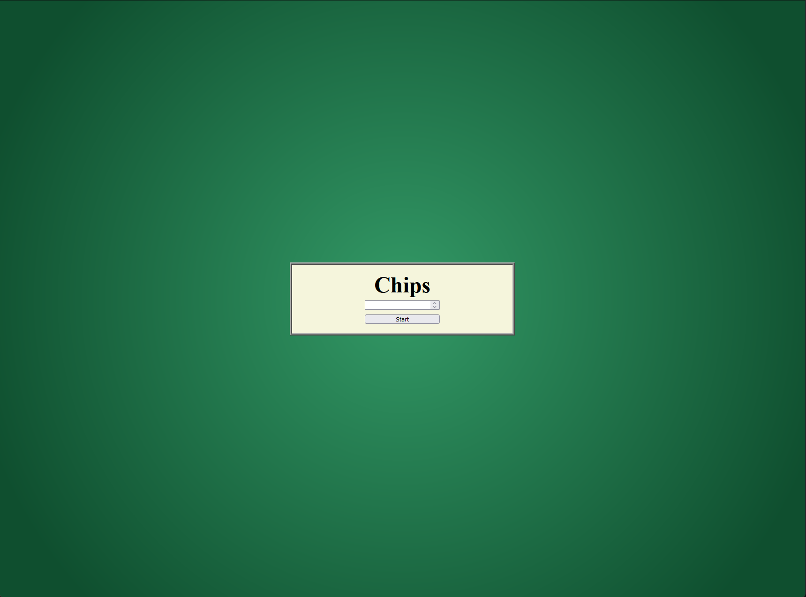
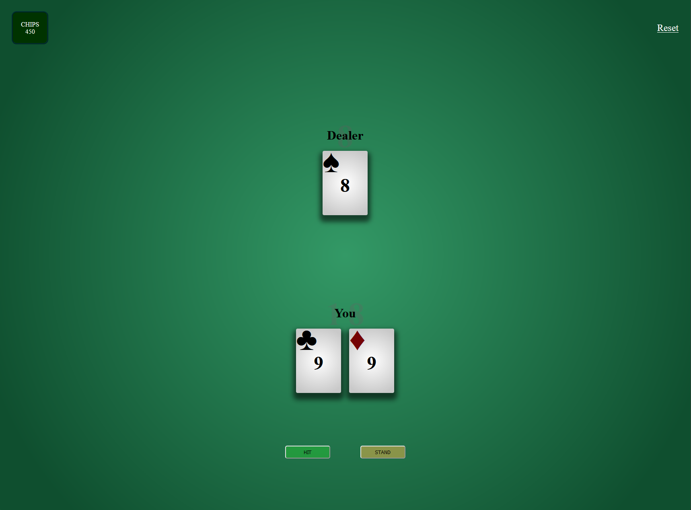
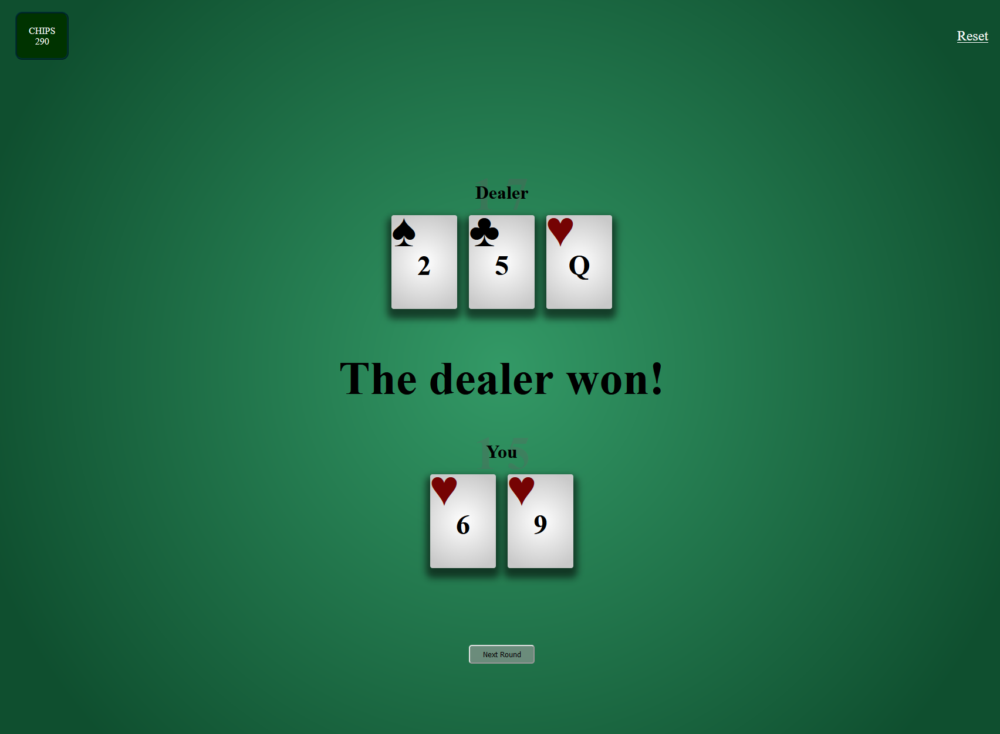

# CasualJack
> *A clean, risk-free blackjack experience for learning and fun!*
### Screenshots

### Description
CasualJack is a web app offering a relaxed, risk-free take on the classic card game blackjack. Perfect for those who love the game but aren't looking to wager money, it provides a safe environment for entertainment, testing strategies, or learning blackjack fundamentals.

This project aims to fill the gap for aesthetic, minimalist versions of the popular card game gone digital. The backend is built with Flask and Python, leveraging knowledge from Harvard's introductory computer science course, [CS50](https://pll.harvard.edu/course/cs50-introduction-computer-science).

### Tech Stack
- **Backend:** Flask (Python)
- **Frontend:** HTML, Jinja
- **Styling:** CSS

### Motivation and challenges
Exploring full stack development and developing self-reliance by reading documentations have been a major motive in the development of this project. As a first-time project, CasualJack has marked the removal of the training wheels. 

Besides providing technical knowledge, the project presented unique challenges, especially around managing real-time game data like chips, current hand, and dealer’s hand. Initially, all frontend-backend interaction relied on HTML and Jinja with Python. In hindsight, using AJAX would have allowed for real-time updates without page reloads. This is a learning point I’ll address in future revisions.

### Future Features
- [ ] **Cheatsheet Chart:** A quick-reference guide advising users on the most favorable move based on both their and the dealer’s hand.
- [ ] **AJAX Integration:** Adding AJAX could enable data updates from the backend without reloading the page, improving game flow.
- [ ] **Card Dealing Animations:** Animated card dealing for a more immersive experience.
- [ ] **Mobile App Expansion:** Bringing CasualJack to mobile platforms.
- [ ] **Multiplayer Mode:** Enabling players to compete against friends in real-time.

